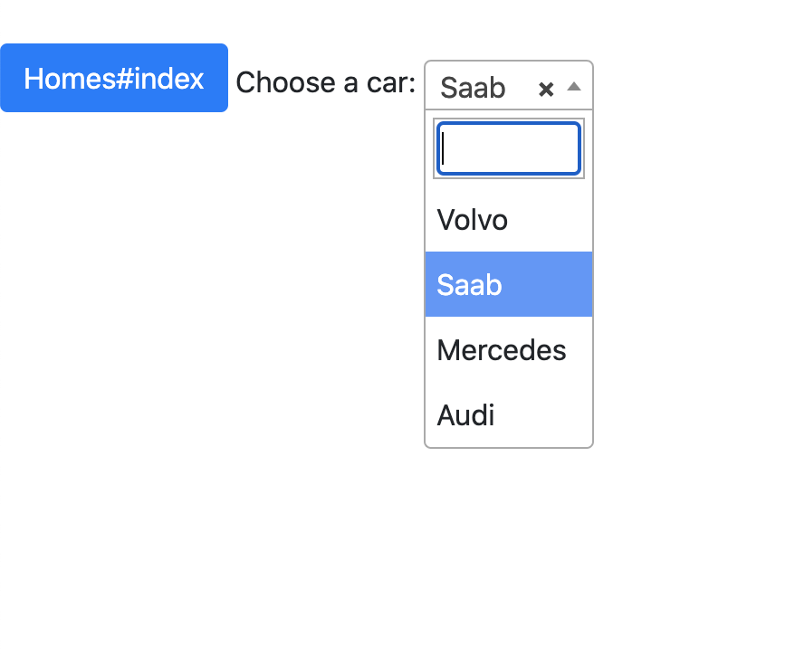

##### Install coffee-loader:

run the command under your rails application.

```
rails webpacker:install:coffee
```

##### Include the application layout file:
layouts/application.html.erb
```
<%= javascript_pack_tag 'hello_coffee' %>
```

###### Install yarn packages

```
yarn add coffeescript coffee-loader jquery bootstrap popper.js
```

###### Replace following codes to environment.js

config/webpack/environment.js
```

const { environment } = require('@rails/webpacker');
const coffee =  require('./loaders/coffee');
const webpack = require('webpack');
environment.plugins.append('Provide', new webpack.ProvidePlugin({
    $: 'jquery',
    jQuery: 'jquery',
    Popper: ['popper.js', 'default']
}));
environment.loaders.prepend('coffee', coffee);

module.exports = environment;
```

##### Then coffee extention inserted

> config/webpacker.yml
```

extensions:
  - .coffee
  - .js
```

> config/webpack/loaders/coffee.js
```
module.exports = {
  test: /\.coffee(\.erb)?$/,
  use: [{
    loader: 'coffee-loader'
  }]
}
```

##### Then Add required file to application.css

> assets/stylesheets/application.css
```
*= require select2
*= require bootstrap
```

##### Then Add required file to application.js

assets/stylesheets/application.js
```
require('jquery');
require('popper.js');
require("channels");
require('bootstrap');
window.jQuery = $;
window.$ = $;
```



